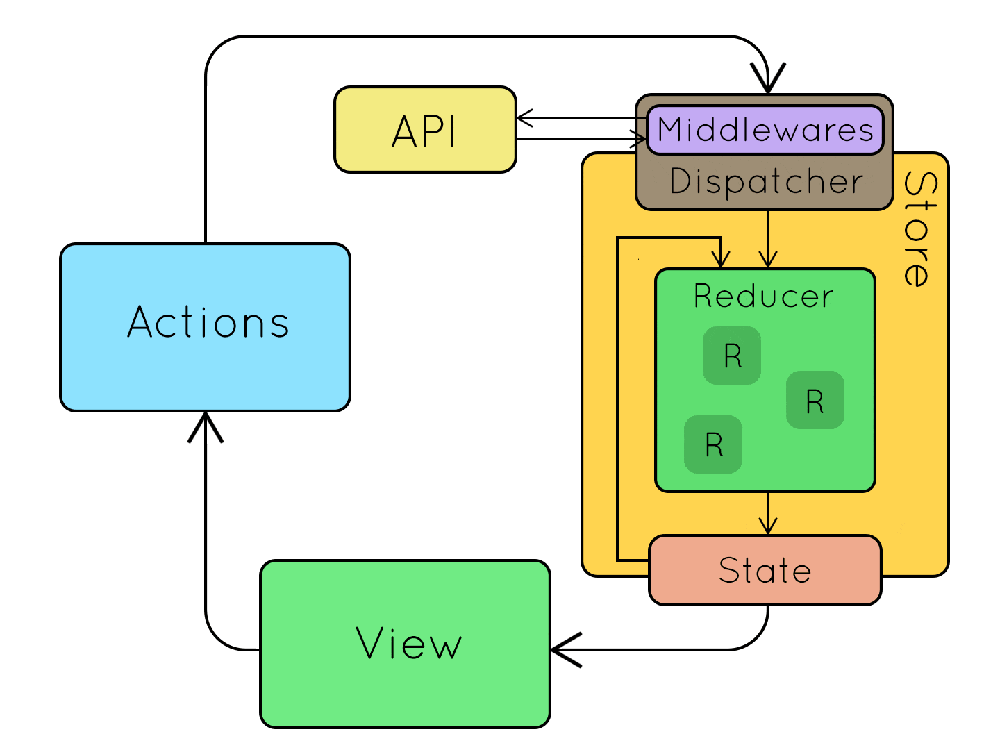
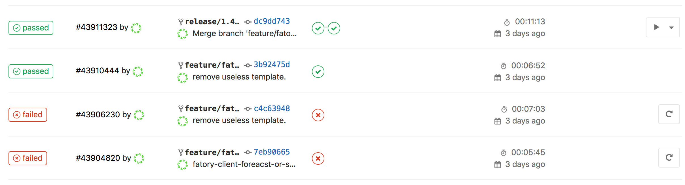

<p align="center">
    
</p>
<h1 align="center">Bicing User Interface APP</h1>

<h4 align="center">Get statistics and locations of bicycle stations.</h4>

> The goal of this APP is to ease customer's usage of large-scale public bicycle sharing system.  
> By displaying data from different providers ([Bicing][bicing], [Velib][velib], ...) it can advice customers and provide them useful information (location to pick or return a bike, best time for picking up a bike, ...).


<p align="center">
    
    <a href="https://opensource.org/licenses/MIT"><a>
</p>

<p align="center">
  <a href="#getting-started">Getting Started</a> •
  <a href="#features">Features</a> •
  <a href="#built-with">Built With</a> •
  <a href="#development">Development</a> •
  <a href="#coding-standard">Coding Standard</a> •
  <a href="#ci-and-deployment">CI and Deployment</a>
</p>


## <a name="getting-started"></a> Getting Started
### Prerequisites

To install and run the API you need [Docker Compose](docker-compose) and... that's all.
Please follow the [official documentation](docker-compose-install) to install it on your environment.

### Installing
Clone the project and run the default installation:

```bash
git clone https://github.com/lechatquidanse/bicing-user-interface-app.git && cd bicing-user-interface-app && make install
```
Your docker containers should have been successfully built and run.

## Features

Multiple features are proposed across the user interface.

### Stations State:
### Predictions for Stations States:
### Itinerary Suggestions:
### And more to come...

## <a name="built-with"></a> Built with

- [Node 8.12.0][node]
- [React 16.5.0][react]
- [Redux-Saga][redux-saga]
- [Docker][docker]

## Development
The Makefile contains useful command for development purpose


## <a name="coding-standard"></a> Coding standard

### Domain Driven Design

Code and folder structure follow Domain Driven Design (DDD).  
Here is a good article to understand naming and folder [Domain Driver Design, little explanation and example](https://jorgearco.com/ddd-with-symfony/).

    src
        \
            |\ Application     `Contains the Use Cases (state management) of the domain system, commands, queries, handlers and providers`
            |
            |\ Domain          `The system business logic layer (Types, Definitions, Exceptions...)`
            |
            |\ Infrastructure  `Its the implementation of the system outside the model. I.E: Rest Call Query, etc`
            |
            |\ UserInterface   `It contains all the interfaces allowed for a user of the APP (Components and Containers)`

### Redux-Saga

In this project, the state is handled by redux-saga.
A reminder on how works redux-saga (from a [great article by aksudupa11](https://medium.com/@aksudupa11/redux-sagas-714370b61692))



Here is some very helpful resources that I encourage you to read to understand redux-saga and the architecture chosen in this project:

- [Understanding redux](https://medium.freecodecamp.org/understanding-redux-the-worlds-easiest-guide-to-beginning-redux-c695f45546f6)
- [Redux-Saga tutorial](https://github.com/redux-saga/redux-saga)
- [Redux-Saga patterns](https://hackernoon.com/redux-saga-pattern-flow-sagas-and-common-sagas-3aa6862533e0)

In this App, to query a station by its stationId, we need:
- actions, to explain if we want to start fetching, to explain that we are in pending a state, that an error occurred...
- operations/middleware, that will trigger a call to get station from a provider and dispatch other actions according to what happened
- reducers, to update state according to actions dispatched
- selectors, to "interface" how the state can be read 

### HOC, components and containers

In this project, user interfaces are divided in two:
- components that handle "low level" template. Their role is display html and css.
- containers that handle "high level" template. Their role is dispatch actions, read state and render components. 
It is basically an **enhanced** version of a components, or called a Higher Order Component (HOC).

Here is some very helpful resources that I encourage you to read to understand HOC:

- [React HOC](https://reactjs.org/docs/higher-order-components.html)
- [An introduction to HOC](https://www.robinwieruch.de/gentle-introduction-higher-order-components/)
- [The Ultimate Guide to HOC](https://medium.freecodecamp.org/higher-order-components-the-ultimate-guide-b453a68bb851)
- [Building HOC with recompose](https://medium.com/front-end-developers/building-hocs-with-recompose-7debb951d101)

By decomposing our UI, it allows us to have a better **SEPARATION OF CONCERNS**. 
Which means easier testing, maintenance and development.


In this APP, to render geo suggestions, we need:
- a component to display the html Select input with some fixtures in it
- a container that will enhanced the component by connecting and reading state, rendering or not if its enabled...


 
## <a name="ci-and-deployment"></a> CI and Deployment

CI and deployment can be handled through [Gitlab][gitlab] and [Docker][docker] thanks to [.gitlab-ci.yml](./.gitlab-ci.yml)
It contains 3 different stages.

### Test

Environment 'test' is triggered when a 'feature/*' branch is pushed to the repository. 
It will then install project and launch qa tools. 

### Build

Environment 'build' is triggered when a 'release/*' branch is pushed to the repository. 
It will then install project, launch qa tools and then build and push a docker image on a registry if no error occured.

### Production

This manual action, will pull the image build by the previous step and update the specific container.



## License

[MIT](https://opensource.org/licenses/MIT)

> Stéphane EL MANOUNI &nbsp;&middot;&nbsp;
> [Linkedin](https://www.linkedin.com/in/stephane-el-manouni/)

[bicing]: https://www.bicing.cat/
[docker]: https://www.docker.com/
[docker-compose]: https://docs.docker.com/compose/
[docker-compose-install]: https://docs.docker.com/compose/install
[gitlab]: https://gitlab.com/
[node]: https://nodejs.org/en/blog/release/v8.12.0/
[react]: https://reactjs.org/
[redux-saga]: https://redux-saga.js.org/
[velib]: https://www.velib-metropole.fr/
[wiki-DDD]: https://en.wikipedia.org/wiki/Domain-driven_design
